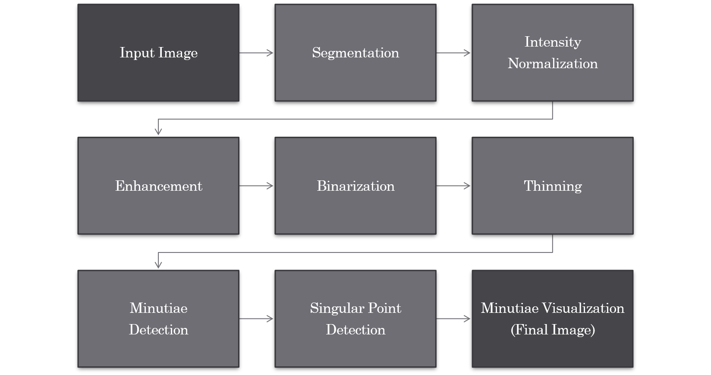
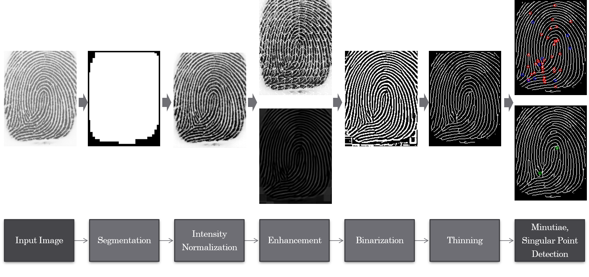
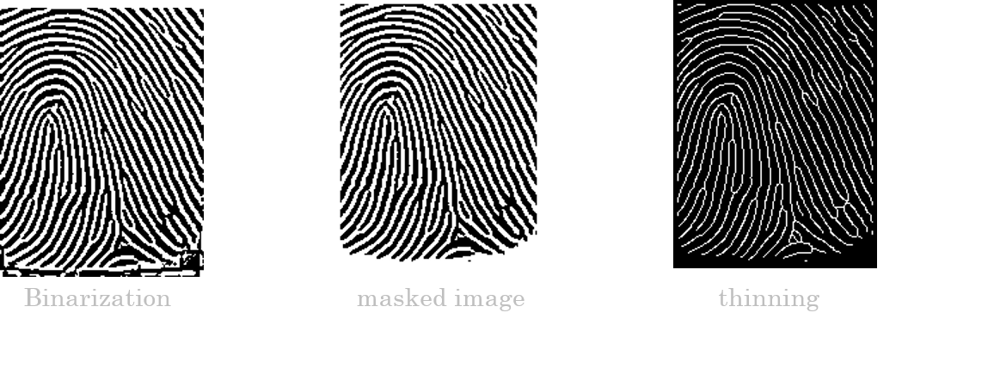
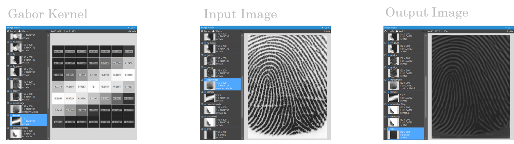
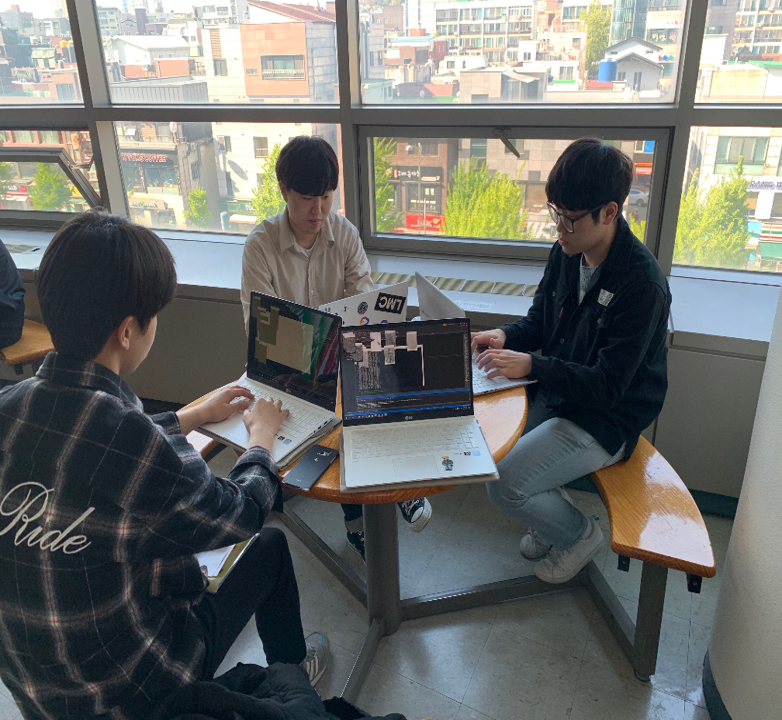

# FingerPrint_detection
Fingerprint detection using OpenCV

# 프로젝트 개요
 * OpenCV를 이용한 지문 영상 취득과 다양한 영상 처리 알고리즘들을 활용하여 이미지를 복원하고 특징점을 찾아 육안으로 특징점을 Counting한 결과와 비교 분석하였음.

#### 지문에는 다음과 같은 특징점들이 존재한다.

## Project Info ❓ :

 * IDE 　　　　　 : 	**Visual Studio 2019** - 2020-03
 * Language　　　: **C++**
 * SDK, Library　 　:	**OpenCV**

## Features ❗ :
 * 지문 프로젝트 : 이미지 강화 (정규화, Gabor 필터 적용)

## Image ❗ :

### 이미지 처리 과정 단계

### 처리 과정 단계 Part별 Result 

### Gabor Filter & Thinning
 

### 미팅 사진 👩‍👩‍👧‍👦

